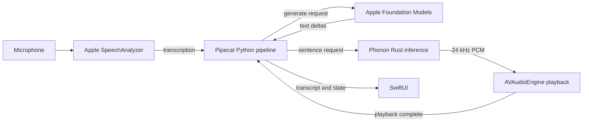

# Embedded voice pipeline



`PCPythonRuntime.m` initializes CPython on a dedicated thread using isolated
configuration and explicit bundle import paths. A built-in `_pipecat_native`
module exposes a thread-safe inbound JSON queue and an outbound main-queue
callback. Python owns its asyncio loop; UIKit/SwiftUI always run on the main
actor. There is no socket listener, subprocess, dynamic code download, or local
web server.

`src/python/mobile_app/bot.py` composes a `PipelineWorker` and `WorkerRunner`, with
signal handling and RTVI disabled. Its pipeline is:

```text
NativeASRInput → FoundationModelProcessor → LLMTextProcessor
              → PhononProcessor → PlaybackContextProcessor
```

The app's four processors live in individual files in
`src/python/mobile_app/processors/`. `native.py` owns native request correlation;
`state.py` owns turn identity and a Pipecat `LLMContext`.

Apple transcriptions enter as `TranscriptionFrame`s and become `LLMContextFrame`s
containing the completed conversation plus the current user utterance. Foundation
Models emits standard LLM start, text, and end frames. Pipecat's `LLMTextProcessor`
and `SimpleTextAggregator` turn deltas into `AggregatedTextFrame`s. The aggregator
uses Apple's `NLTokenizer` through `_pipecat_native.sentence_boundary`, so it does
not need NLTK or tokenizer downloads. Buffered text is limited to 420 characters
for Phonon's per-request limit, and turn metadata survives aggregation and flush.

Phonon emits `TTSTextFrame` only after Swift acknowledges completed playback.
`PlaybackContextProcessor` handles those frames in direct mode, recording the
played text before a subsequent native interruption can arrive. The response-end
frame commits the turn and resumes listening. Native failures travel upstream as
Pipecat `ErrorFrame`s. Audio samples stay native, avoiding JSON/base64 PCM copies
and Python DSP wheels.

Every native operation has a request ID and every user utterance has a turn ID.
Interruptions stop native tasks and playback immediately, then send a Pipecat
`InterruptionFrame` to clear Python processor queues. Cancelled native results
cannot complete later requests. Requests time out and emit cancellation events;
only fully played sentences enter conversation context. The context is bounded
to four pairs and 5,000 characters, with a 2,000-character input limit.

The Phonon C ABI keeps model loading, inference, and destruction on a serial
Swift dispatch queue. A scoped Rust collector streams float PCM. An atomic
cancellation token drops the receiver to stop the model on its next audio send.
Rust panics are caught before reaching the C boundary. Callback sample memory is
borrowed only for the callback duration, copied into a Swift stream, and then
scheduled on the audio player. Playback uses `.dataPlayedBack` acknowledgments.

`scripts/build_native.py` cross-compiles both the model wrapper and pydantic-core,
linking the latter against the target's Python framework. The SentencePiece
toolchain supplies the missing iOS CMake helper without modifying the supplied
model source or the Cargo registry. `scripts/bundle_runtime.py` installs native
Python modules as iOS frameworks and produces their import marker files.

The embedded package set is recorded in `.build/mobile-package-manifest.json`.
The root `uv.lock`, native `Cargo.lock`, pinned source hashes, and separately
supplied model files define the build inputs. Place the complete Phonon package
in `models/phonon/` as described in `models/README.txt`; its contents are ignored
by Git. Gradium keys are entered in the app and stored in the device's Keychain,
with no build-time credential configuration. Changing pydantic-core requires
updating both the staged Python package and the cross-compiled native extension
together.
