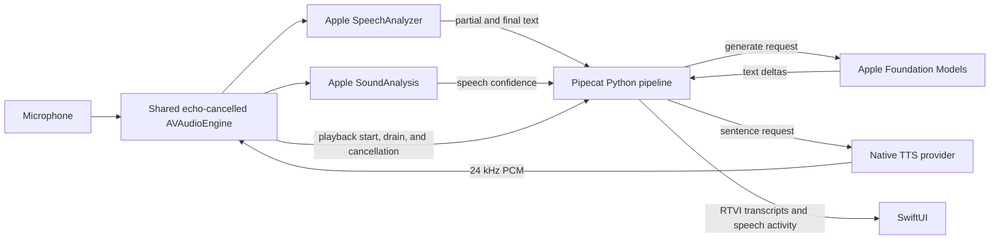

# Embedded voice pipeline



`PCPythonRuntime.m` initializes CPython on a dedicated thread using isolated
configuration and explicit bundle import paths. A built-in `_pipecat_native`
module exposes a thread-safe inbound JSON queue and an outbound main-queue
callback. Python owns its asyncio loop; UIKit/SwiftUI always run on the main
actor. There is no socket listener, subprocess, dynamic code download, or local
web server.

`src/python/mobile_app/bot.py` only configures providers, VAD parameters, context,
the observer, and a `PipelineWorker`. The embedded entry point runs it with a
`WorkerRunner` with signal handling disabled. Its pipeline is:

```text
AppleTransport.input() → AppleSpeechSTTService → context_aggregator.user()
                      → AppleFoundationLLMService → ServiceSwitcher(TTS providers)
                      → AppleTransport.output() → context_aggregator.assistant()
```

The adapters live in the modified Pipecat package, so another embedded Apple bot
can import them without copying the application's processors:

| Module | Native adapter | Pipecat base or reusable component |
| --- | --- | --- |
| `pipecat.services.apple.stt` | `AppleSpeechSTTService` | `STTService` |
| `pipecat.services.apple.llm` | `AppleFoundationLLMService`, `AppleLLMAdapter` | `LLMService`, `BaseLLMAdapter` |
| `pipecat.services.apple.tts` | `AppleNativeTTSService` | Shared Apple/iOS playback base extending `TTSService` |
| `pipecat.services.apple.pocket_tts` | `PocketTTSService` | `AppleNativeTTSService` |
| `pipecat.services.apple.phonon` | `PhononTTSService` | `AppleNativeTTSService` |
| `pipecat.audio.vad.apple` | `AppleVADAnalyzer` | `VADAnalyzer`, `VADParams` |
| `pipecat.transports.apple` | `AppleTransport`, `AppleRTVIObserver` | `BaseTransport`, input/output transport bases, `RTVIObserver` |
| `pipecat.services.apple.bridge` | `AppleNativeBridge` | Native request correlation and worker/session lifecycle |

`LLMContextAggregatorPair` owns the user and assistant aggregators. Partial Apple
transcripts become `InterimTranscriptionFrame`s; immutable segments become
`TranscriptionFrame`s. The user aggregator produces a standard `LLMContextFrame`.
Foundation Models emits standard LLM start, text, and end frames. `TTSService`
owns sentence aggregation and audio-context sequencing. Its injected
`SimpleTextAggregator` uses Apple's `NLTokenizer` through
`_pipecat_native.sentence_boundary`, avoiding NLTK and tokenizer downloads.
Buffered text is limited to 420 characters per native speech request.

`bot.py` imports the concrete `PocketTTSService` and `PhononTTSService` providers.
Their thin subclasses share `AppleNativeTTSService` in the Apple namespace.
A standard Pipecat `ServiceSwitcher` selects the provider from the native
`start.provider` value before each conversation. The existing settings UI remains
the source of provider and voice selection; Swift snapshots those settings and
prepares its `PocketTTSSynthesizer` or optional `PhononSynthesizer`.

Each `speak` request carries its concrete provider ID, and the native host checks
it against the prepared session provider before synthesis. Selection stays fixed
for the conversation. Apple Speech and Foundation Models keep their separate
service imports.

The native TTS adapter selects `audio_playback_is_external=True`. Its
`TTSAudioPlayedFrame` acknowledges that Swift finished playing the sentence,
allowing the base service to release the corresponding `TTSTextFrame` to the
standard assistant aggregator. Cancellation drops unplayed text. Native failures
travel upstream as Pipecat `ErrorFrame`s. Audio samples stay native, avoiding
JSON/base64 PCM copies and Python DSP wheels.

## Native speech detection and turn boundaries

Apple Speech's `SpeechDetector.Result` exposes `speechDetected`, but Apple
[documents an otherwise empty result stream](https://developer.apple.com/documentation/speech/speechdetector/results).
A runtime probe confirmed zero detection results while a paired transcriber
successfully recognized a speech recording. The app therefore uses the supported
[SoundAnalysis streaming classifier](https://developer.apple.com/documentation/soundanalysis/classifying-sounds-in-an-audio-stream),
`SNClassifySoundRequest(classifierIdentifier: .version1)`, and its `speech`
confidence. The model is provided by the operating system; no extra weights or
ONNX runtime are bundled.

`AppleSpeechRecognizer` feeds converted microphone audio to both SpeechAnalyzer
and SoundAnalysis on a dedicated serial processing queue. SoundAnalysis uses a
0.5-second analysis window and 80% overlap, producing one score every 0.1 seconds.
The bridge sends scores, audio timestamps, and an approximate normalized RMS
level to Python. `AppleVADAnalyzer` reuses the base VAD debounce state machine and
rejects duplicate or out-of-order score timestamps. `bot.py` sets confidence to
0.65, start duration to 0.1 seconds, stop duration to 0.6 seconds, and minimum
volume to zero. The classifier window contributes detection latency in addition
to these debounce durations; they are not a promise of 100 ms interruptions.

`AppleSpeechSTTService` converts acoustic activity into
`VADUserStartedSpeakingFrame`/`VADUserStoppedSpeakingFrame` and proposes turn
boundaries with `ProposedUserStartedSpeakingFrame`/`ProposedUserStoppedSpeakingFrame`.
`ExternalUserTurnStrategies` in the standard user aggregator accepts those
boundaries and produces the usual user speech and interruption frames. Acoustic
speech-stop and completed-user-turn events are distinct: the service waits for
final ASR text before proposing the end of the turn.

A new turn requires both acoustic activity and at least one word in an interim
or final Apple transcript. Until then, VAD is only a candidate: it cannot create
a native turn ID, cancel playback, or interrupt Pipecat. This applies throughout
generation and playback, including gaps between TTS sentences. A single word
such as "stop" remains sufficient. ASR results arriving before the first
classifier window are buffered. An acoustic span without text still finalizes
ASR when it ends, allowing a delayed final result to confirm a short utterance.
If that produces no words, it leaves the current bot reply intact. This trades
some interruption latency for resistance to noise-only classifier spikes;
background speech or an incorrect ASR hypothesis can still count as speech.

Apple's [`finalize(through:)`](https://developer.apple.com/documentation/speech/speechanalyzer/finalize(through:))
publishes final results without guaranteeing that the application has consumed
them. A transcript's finalization timestamp also need not cover trailing silence.
To provide a deterministic barrier, the native `finalize_asr` operation ends only
the current ASR input stream, awaits all its final results, and replaces the
transcriber. The shared audio tap and SoundAnalysis remain active. Incoming audio
is retained for up to four seconds and replayed to the replacement with its
original absolute timestamps. Buffer exhaustion is an explicit error. The cut is
at the newest captured audio so trailing words are included. An internal rotation
finishes even if resumed speech cancels the requesting Python endpoint task.

## Playback, interruptions, and RTVI

`VoiceAudioEngine` owns one `AVAudioEngine` for capture and the native PCM player.
The audio session first tries `.playAndRecord` and `.default` with Apple's
[`setPrefersEchoCancelledInput(true)`](https://developer.apple.com/documentation/avfaudio/avaudiosession/setprefersechocancelledinput(_:)).
The ordinary engine is used only after the activated session reports echo
cancellation enabled. Unsupported devices or routes fall back to `.voiceChat`
and VoiceProcessingIO. Apple describes the default-mode option as suitable for
a wider range of audio; voice-chat mode applies speech-oriented tonal processing.
Both paths keep capture active during generation and playback. A route change
that removes the selected echo cancellation stops the conversation rather than
continuing with speaker echo fed into ASR.

This default-mode path also permits checking ordinary app-audio capture with
Control Center Screen Recording. There is no app-side switch that guarantees
Control Center will record a session; device capture must be tested separately
with the recording microphone off and on. No ReplayKit recording UI is added.

Stopping a reply stops the player node rather than the engine;
ending the session stops both. Muting removes capture and cancels ASR, then starts
a fresh input generation on unmute so delayed results cannot transcribe muted
audio.

`PCMPlayer` reports when queued playback starts and when it drains or is cancelled.
The output transport broadcasts `BotStartedSpeakingFrame` and
`BotStoppedSpeakingFrame` for these events. Playback generations prevent an old
completion or cancellation callback from affecting a new reply.

`AppleRTVIObserver` extends the regular Pipecat observer and delivers its message
models through the native JSON callback. SwiftUI consumes `user-started-speaking`,
`user-stopped-speaking`, `vad-user-started-speaking`, `vad-user-stopped-speaking`,
`bot-started-speaking`, `bot-stopped-speaking`, and transcript messages. The UI
shows user/bot activity and recent start/stop feedback. The worker's automatic
network RTVI setup is disabled because this explicit observer already handles
in-process delivery.

Every native operation has a request ID and every user utterance has a turn ID.
Interruptions stop native tasks and playback immediately, then send a Pipecat
`InterruptionFrame` to clear Python processor queues. Cancelled native results
cannot complete later requests. Requests time out and emit cancellation events;
only fully played sentences enter conversation context. The native LLM adapter
selects at most eight prior messages and 5,000 characters for each invocation,
with a 2,000-character user-input limit. The shared context is also trimmed to
eight messages and 5,000 characters after responses and interruptions, retaining
recent turns. The UI transcript remains available until the conversation is cleared.

The TTS provider owns model loading, streaming inference, and cancellation. It
feeds the existing player rather than creating another audio engine. The shared
`AppleNativeTTSService` base keeps playback and context sequencing identical for every
provider. See [native TTS integration](native-tts.md) for the host contract and
bundled PocketTTS configuration.

`scripts/setup.py` first runs `fetch_pocket_tts.py`, which downloads the pinned
English int8 model assets and verifies every SHA-256 checksum. Valid downloads
are reused; incomplete downloads are replaced only after verification. The
manifest also pins the compatible FluidAudio revision used by project generation.

`scripts/build_native.py` cross-compiles pydantic-core against the target's Python
framework. `scripts/bundle_runtime.py` installs native Python modules as signed
iOS frameworks and copies only verified model assets into the app. It does not
download assets during the Xcode build. The compiled Core ML models, tokenizer,
constants, stock voice files, and installed manifest live under `pocket-tts/` in
the bundle; setup's source files remain in the ignored `models/` directory.

The embedded Python package set is recorded in `.build/mobile-package-manifest.json`.
The root `uv.lock`, pinned source hashes, FluidAudio revision, and model checksum
manifest define the public build inputs. Updating pydantic-core requires updating
both the staged Python package and the cross-compiled native extension together.
